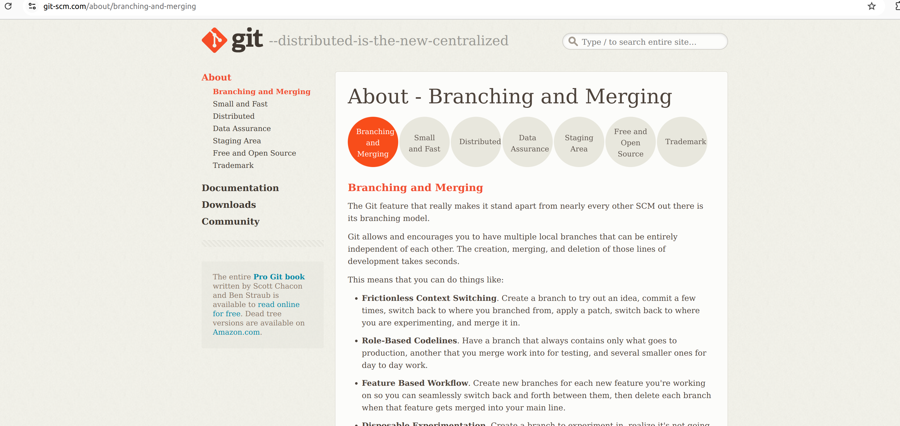
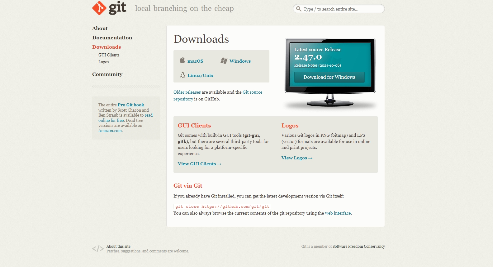
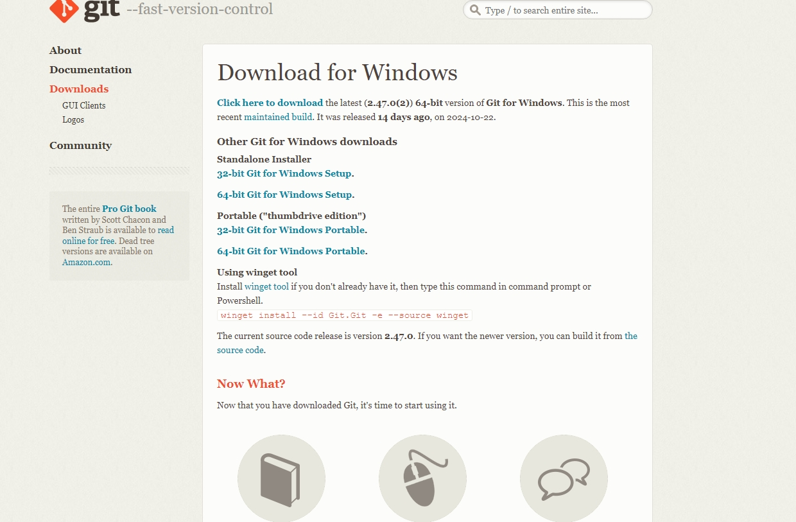
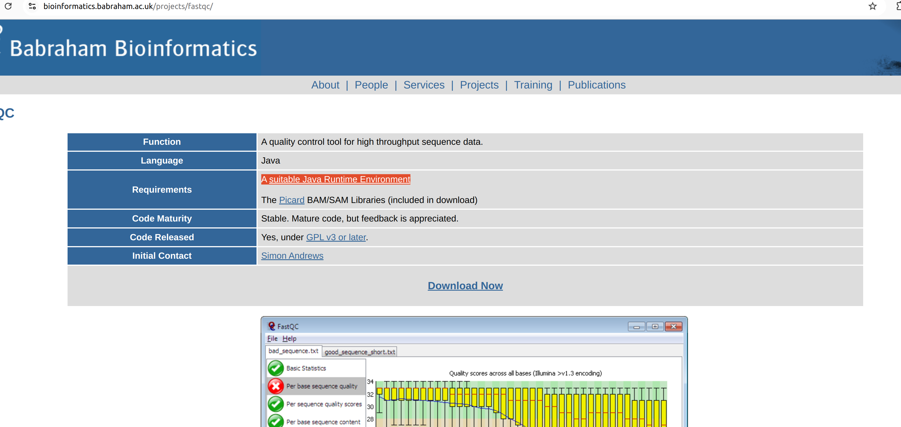

```{r setup, include=FALSE}
knitr::opts_chunk$set(echo = TRUE)
```


### Handling Fastq files

The size of the fastq files can vary from few hundreds of MBs to 10 to 20 GBs depends on the organism and type of the experiment. The fastq files are basically a plain text file which can be opened in any text editing/veiwer application like notepad, notepad++, textpad or gedit etc. But those application have limitation on the file size. So for big files we normally rely on command line based tools such as "less" or "more" in linux based system. If you are using a windows system, you need to install any specialized application that allow you to execute linux utilities in windows. There are many such applications, for this tutorial we use an app called **Git** [See here](https://git-scm.com/about/branching-and-merging). It is an command line application for using version control system and it also provides basic linux utilites that you can make use of. It is easy to install and it is light weight. Download and install the Git app in your system.







Double click the downloaded set-up file and follow the instruction. You can select all the default settings, no need to change anything.

### FastQC

To check the quality of a fastq file, we use the software called FastQC. Download and install the FastQC to your computer from the link here [here](https://www.bioinformatics.babraham.ac.uk/projects/fastqc/).

To use FastQC in your computer, you need to have installed Jave Runtume Environment (JRE) before hand, since the fastqc is a java application.

So, first you need to install JRE in your computer. Link to the set-up file can be found in the fastqc website.



Download the setup and follow the instructions.
 
After the Java installation , download and install Fastqc.


### R & R-studio

We use R and its its Integrated Development Environment (IDE) R Studio for all the analysis. 

A very detailed explanation of how to install R & R studio in windows machine can be found [here](https://teacherscollege.screenstepslive.com/a/1108074-install-r-and-rstudio-for-windows).

For installation in Mac systems, please see [here](https://teacherscollege.screenstepslive.com/a/1135059-install-r-and-rstudio-for-mac)

We use several R packages in our analysis. It is good to install them all prior to the start of the course.

An **R package** is a collection of functions, data, and documentation that extends the functionality of R, allowing users to perform specialized tasks or analyses. Packages are organized into **repositories**, which are online platforms where packages are stored, shared, and maintained. The main repository for R packages is **CRAN** (Comprehensive R Archive Network), which hosts thousands of contributed packages covering a wide range of topics.

**Bioconductor** is another popular repository, specifically designed for packages related to bioinformatics and computational biology. It provides tools for analyzing genomic data, including RNA-seq and microarray data.

To install packages from **CRAN**, you use the `install.packages()` function:
```{r, eval=FALSE}
install.packages("package_name")
```

To install packages from **Bioconductor**, you first need to install the BiocManager package, and then use it to install Bioconductor packages:

```{r,eval=FALSE}
install.packages("BiocManager")
BiocManager::install("package_name")
```

Both repositories provide essential resources for R users across various fields, making it easy to share and reuse code.

### Packages from CRAN used in the analysis

1. ggplot2
2. enrichR
3. circlize
4. dplyr
5. umap

To install open R studio, in the console you can write the below command and hit **Ctrl+Enter**

These packages can be installed by using `install.packages()` function as below

```{r,eval=FALSE}
install.packages("enrichR")
```

Or you can go to the R studio top menu. Tools -> Install Packages -> In the packages field write the package name and click install.

Below are video tutorials showing installation of R packages from CRAN.

<video width="640" height="480" controls>
  <source src="Video/Video1.webm">
  Your browser does not support the video tag.
</video>


### Packages from Bioconductor used in the analysis

1. [Biobase](https://bioconductor.org/packages/release/bioc/html/Biobase.html)
2. [edgeR](https://bioconductor.org/packages/release/bioc/html/edgeR.html)
3. [biomaRt](https://bioconductor.org/packages/release/bioc/html/biomaRt.html)
4. [DESeq2](https://bioconductor.org/packages/release/bioc/html/DESeq2.html)
5. [PCAtools](https://www.bioconductor.org/packages/release/bioc/html/PCAtools.html)
6. [ComplexHeatmap](https://bioconductor.org/packages/release/bioc/html/ComplexHeatmap.html)

In order to install packages from Bioconductor repository, first we need to have `BiocManager` packages from CRAN to be installed.

So first install BiocManager

```{r,eval=FALSE}
install.packages("BiocManager")
```

Then you can install the R packages as below,

```{r,eval=FALSE}
BiocManager::install("ComplexHeatmap")
```

You can also go to the bioconductor page of the corresponding package, you can get the command to install the R packages.

See for example below.

<video width="640" height="480" controls>
  <source src="Video/Video3.webm">
  Your browser does not support the video tag.
</video>


