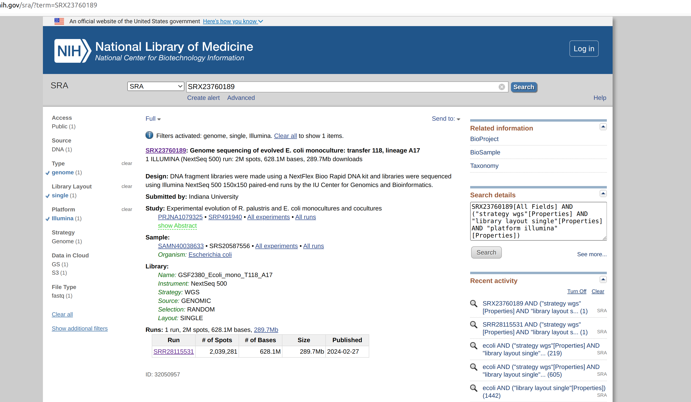
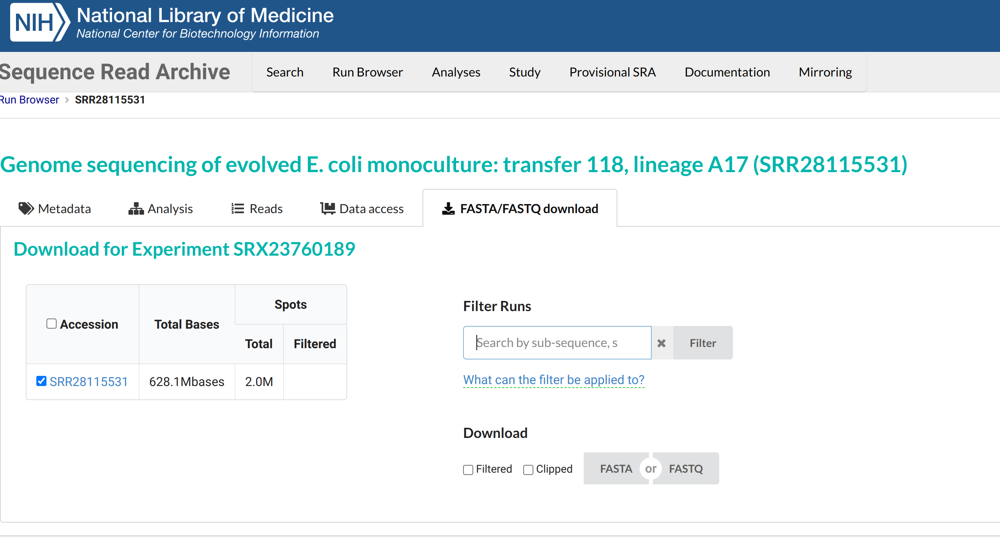

```{r setup, include=FALSE}
knitr::opts_chunk$set(echo = TRUE)
```


## The fastq file format

The FASTQ file format is a widely used format in bioinformatics for storing raw sequencing data from high-throughput sequencing technologies. Each entry in a FASTQ file corresponds to a single sequencing read and is composed of four lines. The first line begins with an "@" symbol followed by a unique identifier for the read. The second line contains the nucleotide sequence (A, T, C, G) of the read. The third line starts with a "+" symbol and may repeat the read identifier or be left blank. The fourth line contains the quality scores, which are represented as a string of ASCII characters corresponding to the probability that each nucleotide in the sequence is incorrect. These quality scores are critical for assessing the accuracy of the sequencing data and for downstream processes such as trimming and alignment. More information about fastq file formats can be read [here](https://knowledge.illumina.com/software/general/software-general-reference_material-list/000002211) and [here](https://en.wikipedia.org/wiki/FASTQ_format)

First let us obtain a fastq file NCBI-SRA for practice. You can go to NCBI SRA and download a fastq file of small size. I am here downloading genomic sequence data of e-coli from SRA. You can access the data using the accession **SRX23760189**. Since it is small file you can download directly from SRA. For big fastq files you will have to use the **SRA-Toolkit** software.



Then click the hyperlink **SRR28115531** to go to the next page.


Then click on the **FASTA/FASTQ download** menu



Download the FASTQ file to your computer.

## The command line

Since we are using command line utilities to handle the fastq file, first we have to get familarieze with few basic commands.

We can practice the commands in gitbash window.

First, create a dummy text file named "Test.txt" and add some text. My "Test.txt" is as below.

ABCD
Hello
Hi All
X

There are four lines and some texts

using the above file and we can practice some commands.

```{r,eval=FALSE,engine='bash'}
# First let us open the file in "less"

less Test.txt

# The above command will open the file in a specific window , to go back press "q" . "q" stands for quit

cat Test.txt

# The above command, will print the contents of the file. Using this we can also concatenate two file.

wc Test.txt
wc -l Test.txt
wc -w Test.txt
wc -m Test.txt

# Try the above commands and find what is the output,
```

